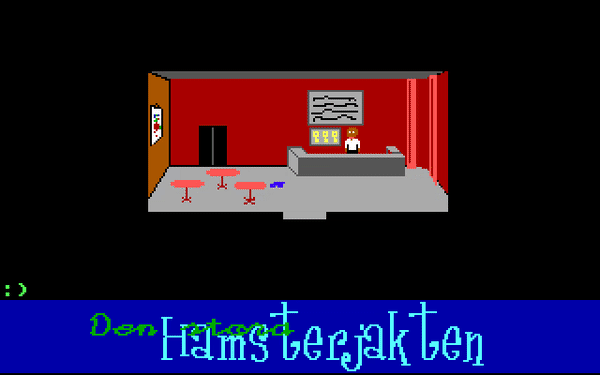

# Den Stora Hamsterjakten

My high school project from 2001 is now open source! :tada:

The game and most of the code is in Swedish.

## How to play

1. Install [Dosbox](https://www.dosbox.com/download.php?main=1) 
2. Clone this repo
3. In Dosbox, run `mount c: /path/to/clone`
4. In Dosbox, run `c:` followed by `SPECARB.EXE`

The character flickers quite a lot when he walks. This was not an issue 20 years ago and I guess Dosbox can be configured to improve the frame rate.

## Tech stack
* Turbo Pascal 7
* Ms Paint
